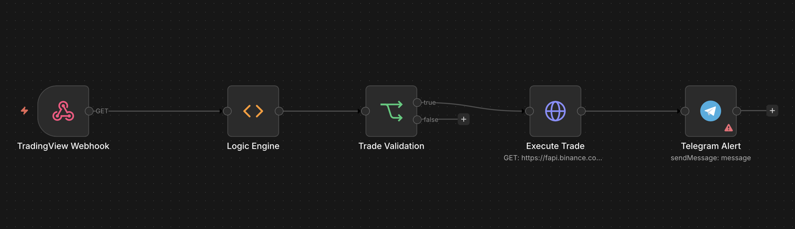

# ULTIMATE_N8N_TRADING_AUTOMATION



An n8n trading automation workflow that turns webhook-based market signals into a structured trade decision, optional Binance Futures execution, and Telegram notifications.

## Why this project stands out

- Signal-driven architecture built around a webhook entry point
- Clear decision layer that separates market logic from order execution
- Simple operational flow that is easy to test, modify, and extend
- Ready for TradingView-style alerts or any system that can send JSON payloads

## Flow at a glance

1. `TradingView Webhook` receives the incoming signal payload.
2. `Logic Engine` evaluates trend, momentum, volume, and volatility.
3. `Trade Validation` blocks inactive setups and only passes valid trades.
4. `Execute Trade` sends the order request to Binance Futures.
5. `Telegram Alert` reports the trade action after execution.

## Decision logic

The workflow checks:

- EMA 50 vs EMA 200 for trend direction
- RSI for momentum confirmation
- MACD vs signal line for directional confirmation
- Volume vs average volume for participation strength
- ATR for minimum volatility confirmation

If the bullish or bearish conditions are aligned, the workflow returns `LONG` or `SHORT`. Otherwise it returns `NONE`.

## Requirements

- n8n instance with webhook access
- Binance Futures API credentials
- Telegram bot token and chat ID
- A signal source such as TradingView or another webhook publisher

## Setup

1. Import `n8n-trading-otomation.json` into n8n.
2. Connect your signal source to the webhook path `trading-webhook`.
3. Replace placeholder values in the workflow, especially `YOUR_CHAT_ID`.
4. Configure Binance authentication exactly as required by your deployment.
5. Run test payloads before enabling any live order flow.

## Example payload

```json
{
  "symbol": "BTCUSDT",
  "close": 65000,
  "ema50": 64800,
  "ema200": 64200,
  "rsi": 61,
  "macd": 120,
  "signal": 100,
  "volume": 15320,
  "avgVolume": 11000,
  "atr": 1.2
}
```

## Files in this repository

- `n8n-trading-otomation.json` - workflow export
- `image.png` - workflow overview visual
- `README.md` - project documentation
- `LICENSE` - MIT license

## Important note

This project is provided for educational and automation purposes only. Trading cryptocurrencies and derivatives involves substantial risk. Always verify logic, credentials, risk settings, and exchange behavior before enabling live execution.

---

# Türkçe

## ULTIMATE_N8N_TRADING_AUTOMATION

Bu proje, webhook ile gelen piyasa sinyallerini önce analiz eden, ardından uygun ise Binance Futures tarafında emir oluşturan ve sonuçları Telegram üzerinden bildiren bir n8n trading otomasyonudur.

## Neden güçlü bir yapı

- Sinyal tabanlı, temiz ve anlaşılır bir mimari
- Piyasa analizi ile emir gönderme adımlarını birbirinden ayırır
- Test etmesi, geliştirmesi ve genişletmesi kolaydır
- TradingView benzeri webhook gönderebilen tüm sistemlerle kullanılabilir

## Akış özeti

1. `TradingView Webhook` gelen sinyal verisini alır.
2. `Logic Engine` trend, momentum, hacim ve volatiliteyi analiz eder.
3. `Trade Validation` uygun olmayan işlemleri eler.
4. `Execute Trade` Binance Futures emir isteğini gönderir.
5. `Telegram Alert` işlem sonrası bildirim oluşturur.

## Karar mantığı

Workflow şu değerleri kontrol eder:

- Trend yönü için EMA 50 ve EMA 200
- Momentum teyidi için RSI
- Yön teyidi için MACD ve signal line karşılaştırması
- Güç teyidi için volume ve average volume
- Volatilite teyidi için ATR

Koşullar uyumluysa workflow `LONG` veya `SHORT` döndürür. Uygun değilse `NONE` döner.

## Gereksinimler

- Webhook erişimi olan bir n8n kurulumu
- Binance Futures API bilgileri
- Telegram bot token ve chat ID
- TradingView veya benzeri bir sinyal kaynağı

## Kurulum

1. `n8n-trading-otomation.json` dosyasını n8n içine aktarın.
2. Sinyal kaynağınızı `trading-webhook` path’ine bağlayın.
3. Workflow içindeki yer tutucuları güncelleyin, özellikle `YOUR_CHAT_ID`.
4. Binance kimlik doğrulamasını kendi ortamınıza göre yapılandırın.
5. Canlıya geçmeden önce test payload’ları ile kontrol edin.

## Örnek payload

```json
{
  "symbol": "BTCUSDT",
  "close": 65000,
  "ema50": 64800,
  "ema200": 64200,
  "rsi": 61,
  "macd": 120,
  "signal": 100,
  "volume": 15320,
  "avgVolume": 11000,
  "atr": 1.2
}
```

## Repo dosyaları

- `n8n-trading-otomation.json` - workflow export dosyası
- `image.png` - otomasyon genel görünüm görseli
- `README.md` - proje dokümantasyonu
- `LICENSE` - MIT lisansı

## Önemli not

Bu proje yalnızca eğitim ve otomasyon amaçlıdır. Kripto para ve türev piyasaları ciddi risk içerir. Canlı işlem açmadan önce mantığı, kimlik bilgilerini, risk ayarlarını ve borsa davranışını mutlaka doğrulayın.
